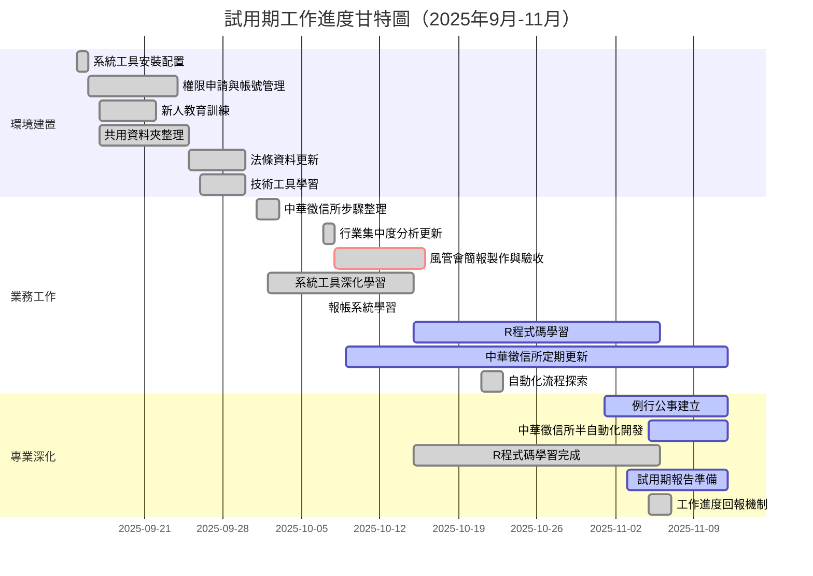

# 試用期報告 - 工作進度甘特圖（2025年9月-11月）

## 📅 工作進度甘特圖

## 📊 工作項目時間軸說明

### 第一階段：環境建置與適應（9月15日-9月30日）

| 工作項目 | 開始日期 | 完成日期 | 持續天數 | 狀態 |
|---------|---------|---------|---------|------|
| 系統工具安裝配置 | 2025-09-15 | 2025-09-16 | 2天 | ✅ 完成 |
| 權限申請與帳號管理 | 2025-09-16 | 2025-09-24 | 9天 | ✅ 完成 |
| 新人教育訓練 | 2025-09-17 | 2025-09-22 | 6天 | ✅ 完成 |
| 共用資料夾整理 | 2025-09-17 | 2025-09-25 | 9天 | ✅ 完成 |
| 法條資料更新 | 2025-09-25 | 2025-09-30 | 6天 | ✅ 完成 |
| 技術工具學習 | 2025-09-26 | 2025-09-30 | 5天 | ✅ 完成 |

**階段重點**：建立工作環境，完成新人訓練，熟悉公司制度與工具

---

### 第二階段：業務工作開始與驗收（10月1日-10月31日）

| 工作項目 | 開始日期 | 完成日期 | 持續天數 | 狀態 | 重要性 |
|---------|---------|---------|---------|------|--------|
| 中華徵信所步驟整理 | 2025-10-01 | 2025-10-03 | 3天 | ✅ 完成 | ⭐⭐⭐ |
| 行業集中度分析更新 | 2025-10-07 | 2025-10-08 | 2天 | ✅ 完成 | ⭐⭐⭐ |
| **風管會簡報製作與驗收** | **2025-10-08** | **2025-10-16** | **9天** | ✅ **完成** | ⭐⭐⭐⭐⭐ |
| 系統工具深化學習 | 2025-10-02 | 2025-10-15 | 14天 | ✅ 完成 | ⭐⭐⭐ |
| 報帳系統學習 | 2025-10-07 | 2025-10-07 | 1天 | ✅ 完成 | ⭐⭐ |
| R程式碼學習 | 2025-10-15 | 2025-11-06 | 23天 | ✅ 完成 | ⭐⭐⭐⭐ |
| 中華徵信所定期更新 | 2025-10-09 | 持續進行 | - | 🔄 進行中 | ⭐⭐⭐ |
| 自動化流程探索 | 2025-10-21 | 2025-10-23 | 3天 | ✅ 完成 | ⭐⭐⭐ |

**階段重點**：完成首次重要業務驗收，建立定期工作機制，開始思考自動化

---

### 第三階段：專業深化與自動化開發（11月1日-11月12日）

| 工作項目 | 開始日期 | 完成日期/狀態 | 持續天數 | 狀態 | 重要性 |
|---------|---------|--------------|---------|------|--------|
| 例行公事建立 | 2025-11-01 | 持續進行 | - | 🔄 進行中 | ⭐⭐⭐⭐ |
| **中華徵信所半自動化開發** | **2025-11-05** | **進行中** | **8天+** | 🔄 **進行中** | ⭐⭐⭐⭐⭐ |
| R程式碼學習完成 | 2025-10-15 | 2025-11-06 | 23天 | ✅ 完成 | ⭐⭐⭐⭐ |
| 試用期報告準備 | 2025-11-03 | 進行中 | 10天+ | 🔄 進行中 | ⭐⭐⭐⭐ |
| 工作進度回報機制 | 2025-11-05 | 2025-11-07 | 3天 | ✅ 完成 | ⭐⭐ |

**階段重點**：開發自動化工具提升效率，完成核心程式碼學習，準備試用期報告

---

## 🎯 關鍵里程碑

### 里程碑 1：環境建置完成（2025-09-30）
- ✅ 所有系統工具安裝完成
- ✅ 權限申請完成
- ✅ 新人訓練完成
- ✅ 基礎知識建立完成

### 里程碑 2：首次業務驗收通過（2025-10-16）⭐
- ✅ 風管會簡報製作完成
- ✅ 資料整合與分析能力展現
- ✅ 通過主管驗收

### 里程碑 3：自動化工具開發啟動（2025-11-05）⭐
- ✅ VBA 自動化工具完成
- ✅ AHK 腳本開發進行中
- ✅ 工作效率顯著提升

### 里程碑 4：核心程式碼學習完成（2025-11-06）⭐
- ✅ R 程式碼閱讀完成
- ✅ 資料處理邏輯理解
- ✅ 為接手建模工作做準備

---

## 📈 工作進度統計

### 完成度分析

| 類別 | 總項目數 | 已完成 | 進行中 | 完成率 |
|------|---------|--------|--------|--------|
| 環境建置 | 6 | 6 | 0 | 100% |
| 業務工作 | 8 | 6 | 2 | 75% |
| 專業深化 | 5 | 2 | 3 | 40% |
| **總計** | **19** | **14** | **5** | **74%** |

### 時間分配

- **環境建置階段**：16個工作天（9/15-9/30）
- **業務工作階段**：23個工作天（10/1-10/31）
- **專業深化階段**：9個工作天（11/1-11/12，進行中）

---

## 💡 重點工作項目詳細說明

### ⭐⭐⭐⭐⭐ 風管會簡報製作與驗收（10/8-10/16）

**工作內容**：
- 整合多個系統資料（前十大、行業集中度、會計師淨值等）
- 更新走勢圖資料至 Notion
- 製作完整簡報並通過驗收

**成果**：
- 成功完成首次重要業務驗收
- 展現資料整合與分析能力
- 理解風險管理業務流程

**技術應用**：
- Excel 資料處理
- Notion 協作平台
- 簡報製作技巧

---

### ⭐⭐⭐⭐⭐ 中華徵信所半自動化開發（11/5-進行中）

**工作內容**：
- VBA 自動化：Word + Outlook 整合，自動更新信件日期
- 信件範本系統：實現「電腦選號」生成信件內文
- AHK 腳本：自動下載客交表功能
- PDF 讀取功能（規劃中）

**成果**：
- 信件生成從手動改為自動化
- 節省每週重複性工作時間
- 減少人為錯誤

**技術應用**：
- VBA 程式設計
- AutoHotkey 腳本開發
- 系統整合能力

---

### ⭐⭐⭐⭐ R 程式碼學習（10/15-11/6）

**工作內容**：
- 閱讀「會計本餘_讀取_彙整_入DB.R」程式碼
- 學習 data.table 語法
- 理解資料處理邏輯
- 整理資料庫使用內容

**成果**：
- 理解公司核心資料處理邏輯
- 掌握進階 R 語言技巧
- 為接手建模工作做好準備

**技術應用**：
- R 語言程式設計
- data.table 套件
- 資料庫操作

---

## 🔄 持續進行中的工作

1. **中華徵信所定期更新**（10/9 開始）
   - 每週一：Part 1 更新
   - 每週：Part 2 更新
   - 狀態：持續進行中

2. **例行公事執行**（11/1 開始）
   - 每日：大陸風模（上午、下午）
   - 每日：鄧白氏更新
   - 狀態：持續進行中

3. **中華徵信所半自動化開發**（11/5 開始）
   - VBA 工具：✅ 完成
   - AHK 腳本：🔄 進行中（PDF 讀取功能待開發）
   - 狀態：持續優化中

4. **試用期報告準備**（11/3 開始）
   - 內容整理：🔄 進行中
   - 簡報製作：待開始
   - 狀態：準備中

---

*本甘特圖基於 2025年9月-11月工作日誌整理*

